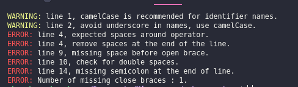
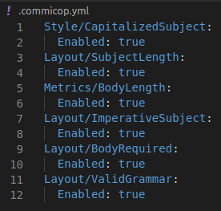

# Capstone project: Build your own linter

### Additional description about the project and its features

## Built With

- Ruby [ruby 2.7.0p0 (2019-12-25 revision 647ee6f091) [x86_64-linux]]


## Code testing cleaning tools

- Stickler ci (Ruby in the repository)

## Build your own linter background
The project description in from Microverse capstone projects on the Ruby section [Link to Description:](https://www.notion.so/Build-your-own-linter-b17a3c22f7b940c98ca1980250720769)

## Installation
**To run this project yo have to have this repo on your computer**
To get a local copy up and running follow these simple steps.

This linter check the following standards in .js files: 
* If find a capital letter in the indetifier names and recommend to use camelCase instead.
* If find underscore in the indetifier names and recommend to use camelCase instead.
* If there is a semicolon at the end.
* If there are spaces around operators.
* If there is a space before opening brace.
* If find a space at the end of the line, send a message to remove it.
* If find a double space in line, send a message to use one space.
* And if there is a missing opening or closing brace.

### Requirements

- ruby > 2.6.x
- git > 2.x
- bundler > 2.x

### Setup

Download or clone this repository to your machine.

* To clone, go to "Clone or Download" and click on Download ZIP and extract the files to a folder in your computer

From the command line:

   `$ git clone https://https://github.com/rkyankya/ruby-capstone.git`


### Usage
* Change the "test_file.js" to suit your needs
  Then run the executable file in your terminal :   ``` ./bin/main.rb ```
  
* [Link to video Usage](https://www.loom.com/share/41509cd67342429d9ce9506727f8305c)

### Run tests
* This is an example in the .js file
```
FirstName = 'John';
last_Name = 'Doe';

fullName = firstName+ lastName; 
``` 
Should be displayed the next output:



You can enable or disable the test validations in the .commicop.yml file in the root directory



## Author
Feel free to reach out to me with any of the links below
**Kyankya Raymond**
   

 - [Github](https://github.com/rkyankya)
 - [Twitter](https://twitter.com/rkyankya)
 - [Linkedin](https://www.linkedin.com/in/kyankya-raymond-79461215a/)

## 🤝 Contributing

Contributions, issues and feature requests are welcome!

Feel free to check the [issues page](https://github.com/rkyankya/ruby-capstone/issues).

## Show your support

Give a ⭐️ if you like this project!


## 📝 License

This project is [MIT](LICENSE) licensed.

